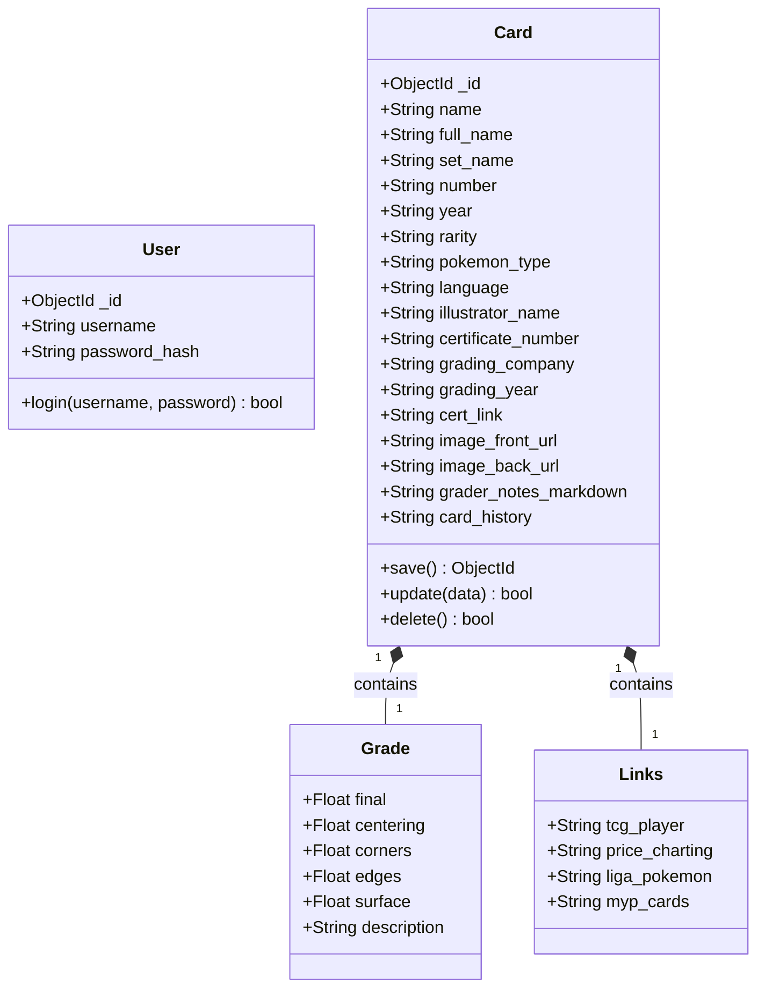
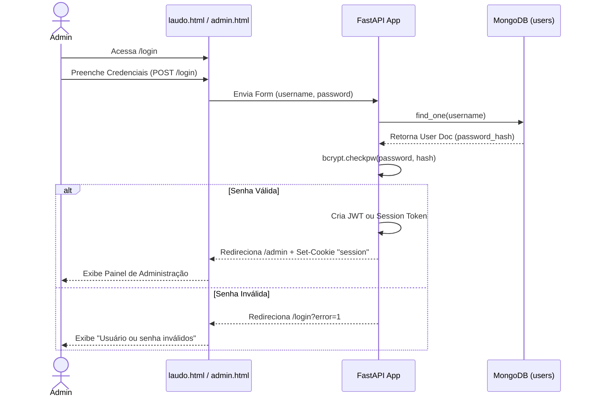
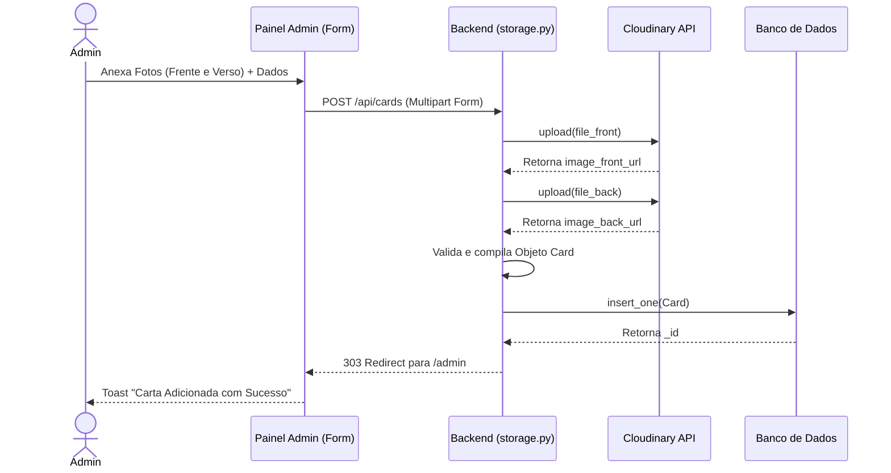

# Diagramas UML de Modelagem (Mermaid)

Este documento centraliza a arquitetura visual do Laudo Cards para facilitar o entendimento técnico e onboarding de novos engenheiros.

## 1. UML de Classes (Domínio de Dados)

O banco de dados é um MongoDB NoSQL, mas conceitualmente modelamos as entidades da seguinte forma:

## 2. UML de Sequência: Autenticação Administrativa

Fluxo demonstrando como a persistência de sessão foi implementada com Cookies criptografados (FastAPI e bcrypt).

## 3. UML de Sequência: Upload de Mídia (Cloudinary)

Fluxo demonstrando o armazenamento na nuvem e a inserção no banco de dados.

